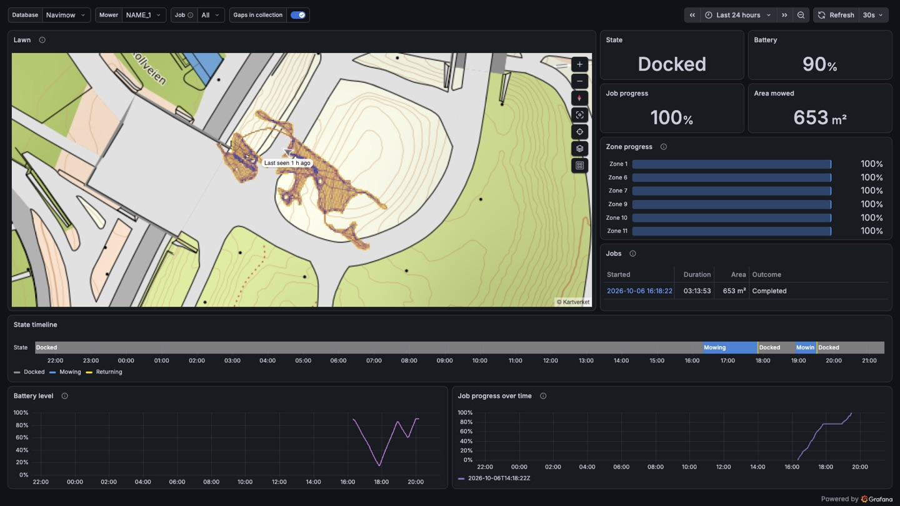

# Dashboards

One dashboard per database the collector writes to, for an owner to import. A panel plugin
cannot install dashboards itself, so these are files.

| File | Database | Needs |
| --- | --- | --- |
| `navimow-postgresql.json` | PostgreSQL | collector schema version 8 or later |

The Job is the real capture in `fixtures/`, on a dock placed where none stands.

## Importing

1. Install the Navimow map panel, and add the collector's database to Grafana as a PostgreSQL
   data source.
2. In Grafana, choose **Dashboards → New → Import** and upload the file. Nothing in it needs
   editing: the **Database** variable at the top picks the data source, and starts on the first
   PostgreSQL one it finds.
3. Edit the **Lawn** panel and set its Dock origin, then save. No file can know where a dock
   stands, so until then the map asks for it and everything else works.

To provision it instead, point a
[dashboard provider](https://grafana.com/docs/grafana/latest/administration/provisioning/#dashboards)
at this directory.

## What it shows

The top of the dashboard follows the time picker, which starts on the last 24 hours, and the
**Job** variable, which starts on All.

- **Lawn**: every Trail in the time range. Clicking one selects its Job.
- **State** and **Battery**: as the mower last reported them, at the end of the time range.
- **Job progress**, **Area** and **Zone progress**: the selected Job, or with All the
  newest in the time range. A Zone shows its highest report, because the mower counts a Zone
  from zero again after a charging break.
- **Jobs**: each Job in the time range. Clicking when one started selects it.
- **State timeline**, **Battery level** and **Job progress over time**. A gap in collection is
  marked on these three.

The **Season** row keeps its own ranges, whatever the time picker says:

- **Area per week**: the area of the Jobs that started in each of the last 26 weeks.
- **Time on Jobs**: from leaving the dock to being back at it, over every Job recorded.
  Charging breaks inside a Job are counted. A Job with no end yet counts as far as the mower
  was last heard from on it.
- **Errors**: each time the mower went into error or was lifted, in the last 26 weeks.

## Worth knowing

- **The Job variable lists Jobs in UTC.** A Job is named by the second it started in UTC, and
  the query behind the variable cannot see the time zone of the browser reading it. The Jobs
  table and every time axis are in the dashboard's own time zone.
- **A time range with no Job in it** lists one option under Job, "No Jobs in range", and a
  database with no mower in it yet lists "No mowers yet". Grafana shows a variable whose query
  returns nothing as an error, and these are in place of that.
- **Weeks run Monday to Sunday in the database's time zone**, which is UTC unless the server is
  set otherwise.
- **There is no signal-strength panel**: no mower has yet been seen to report one.

## Changing a dashboard

Edit it in Grafana, export it with **Share → Export → Export as JSON**, and replace the file.
The panel's browser tests open these files as they are, against a PostgreSQL filled by replaying
a real capture (`panel/tests/seed.py`), so `pnpm run e2e` in `panel/` says whether every panel
still has something to show.

## Licence

Apache-2.0, as the panel they are released with: [`../panel/LICENSE`](../panel/LICENSE).
